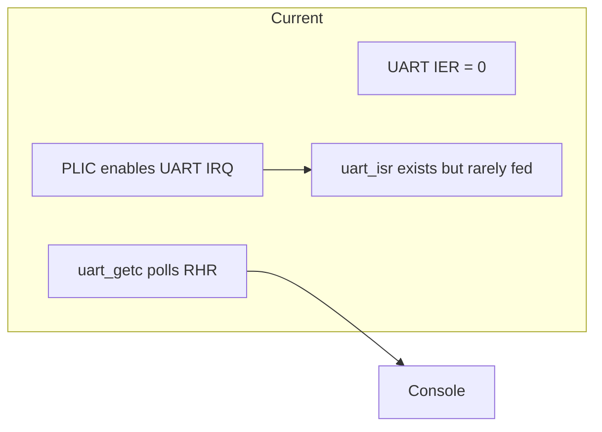
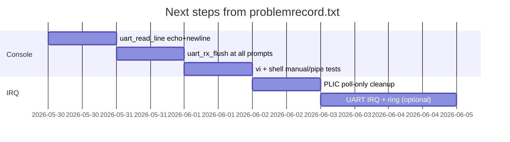

Based on `problemrecord.txt`, the work that’s already done (filesystem, `vi`, cross-compile via `./compile.sh c <file>`) is in good shape. What’s left are **two open issues**. Here is a concrete plan aligned with the symptoms and the current code.

---

## Current state

| Area | Status |
|------|--------|
| FS + user `home/root` | Done |
| `vi`, `compile.sh`, normal shell commands | Done |
| Console UX (prompts, echo, `vi`) | **Broken** (issue 1) |
| Interrupt model for UART vs timer/PLIC | **Inconsistent** (issue 2) |

The transcript in `problemrecord.txt` matches known UART/console bugs:

- Duplicate prompt: `root@/home/root$ root@/home/root$`
- Prompt glued into input: `/home/root$/home/root`
- `vi` shows `: : :` and no visible typing
- `uart_read_line` does not echo printable characters (only backspace)

`uart.c` says prompts should call `uart_rx_flush()`, but **nothing in `console.c` / `vi.c` does** — only `uart_init()` flushes once.

---

## Priority 1 — Fix console character/display (issue 1)

**Goal:** One clean line per prompt; typed text visible in shell and `vi`; `:wq` / `:q!` work.

### Step 1.1 — Fix `uart_read_line` (core)

In `code/myos/boot/uart.c`:

1. **Echo printable input** (`32 <= c < 127`) with `uart_putc(c)` — fixes “cannot display” in `vi` and normal typing feedback.
2. **Print `\n` after Enter** — avoids the next prompt sticking to the previous line (`root@...$/home/root`).
3. Optionally handle `\r` consistently (some terminals send CR only).

### Step 1.2 — Flush RX before every blocking read

Before each `uart_read_line` in:

- `login_session()` (`console.c`)
- `shell_loop()` prompt
- `vi_edit()` `": "` loop (`vi.c`)

call **`uart_rx_flush()`** (and keep or simplify `uart_drain_echo_prefix`).

Right now loopback / stale bytes can be read as command text → duplicated prompts and path corruption.

### Step 1.3 — Prompt strategy

Pick one approach and stick to it:

| Option | Action |
|--------|--------|
| **A (minimal)** | Keep kernel-printed prompt + `uart_rx_flush()`; rely on `start_qemu.sh` `stty -echo` for host |
| **B (safer)** | Centralize in something like `uart_prompt_and_read_line(prompt, buf, len)` = `puts` + `flush` + `read_line` |

Avoid both host echo and kernel echo fighting (document: run `./sh/start_qemu.sh` in foreground, not `qemu ... &`).

### Step 1.4 — `vi` UX (small)

- After Step 1.1, content lines should echo; `:wq` line should show as typed.
- Consider a short delay or extra `uart_rx_flush()` when entering `vi` after a noisy command.

### Step 1.5 — Regression tests

```bash
# Automated login + one command
printf 'root\r\nls\r\n' | ./sh/start_qemu.sh

# vi save (after fixes)
printf 'root\r\nvi 1.txt\r\nhello\r\n:wq\r\ncat 1.txt\r\n' | ./sh/start_qemu.sh
```

Manual checklist:

- [ ] Single `login:` / single `root@/home/root$` per line  
- [ ] `cd`, `pwd`, `cat`, `touch`, `vi` without garbled prompt  
- [ ] `vi 1.txt` → type text → `:wq` → `cat 1.txt` shows content  

---

## Priority 2 — Unify interrupt / UART input (issue 2)

**Goal:** One clear model for grading (`task.md`: keyboard ≈ UART RX) and for OSViz `irq` stats — no “PLIC UART IRQ + polling RHR” hybrid.

### Current mismatch



- `plic_init()` enables UART on PLIC (`plic.c`).
- `uart_irq_enable()` forces **poll-only** (`uart_rx_use_irq = 0`, IER off).
- `uart_isr()` still exists; duplicate consumption was already a concern in comments.

### Step 2.1 — Choose one model

| Model | When to use | Changes |
|-------|-------------|---------|
| **A — Poll-only (short-term)** | Fix console first; defer “real” keyboard IRQ | In `plic_init()`, **do not** enable `UART0_IRQ`; keep timer + soft IRQ; document `rx_poll: true` in OSViz |
| **B — IRQ + ring (target for §2)** | Matches `plan.md` Phase C | `uart_irq_enable()`: `uart_rx_use_irq=1`, `IER` RX on; `uart_getc` **only** from ring; `uart_isr` **only** reader of RHR; remove poll branch in `uart_getc` |

Recommendation: **finish Priority 1 with model A**, then **switch to B** as a focused change with a pipe test so you don’t reintroduce duplicate characters.

### Step 2.2 — If moving to IRQ mode (B)

1. Enable RX in `uart_write_reg(UART_IER, UART_IER_RX)`.
2. `external_interrupt_handler` → `uart_isr` → ring only.
3. Never read RHR in `uart_getc` when `uart_rx_use_irq`.
4. Console reads only via `uart_getc` / `uart_read_line` (no second path).
5. Update `osviz_event("irq", "uart_init", ...)` to `rx_irq: true`.
6. Confirm timer/preempt: long `uart_getc` wait must not deadlock (interrupts re-enabled outside trap handler — verify under OpenSBI S-mode).

### Step 2.3 — Align with course requirements

From `task.md` / `plan.md`:

- Timer ~100 Hz — already separate; keep.
- “Keyboard” — document as **UART RX** on virt.
- OSViz snapshot: `uart_rx_chars` should reflect the chosen path only.

---

## Suggested order of work



| # | Task | Est. | Blocks |
|---|------|------|--------|
| 1 | `uart_read_line`: echo + trailing `\n` | ~1 h | `vi` display |
| 2 | `uart_rx_flush()` before every prompt/read | ~30 min | duplicate prompt |
| 3 | Pipe + interactive test script | ~1 h | sign-off issue 1 |
| 4 | Disable PLIC UART if staying on poll | ~30 min | issue 2 clarity |
| 5 | (Later) Full UART IRQ path | 1–2 d | `task.md` keyboard IRQ |

---

## Out of scope for these two issues (unless you want them next)

Already satisfied per `problemrecord.txt` “已完成” — no need to redo unless regressions appear:

- Packaged `home/root`, `./compile.sh c <name>`, `./program`, `sh script.sh`
- FS create/read via normal commands

Possible **follow-ups** after console/IRQ are stable:

- `task.md` tests: `file_rw.c`, `ps aux`, worker spawn under load
- OSViz host bridge / web dashboard (`plan.md` Phase E)
- Page-fault stub → real VM (later module)

---

## Success criteria (close `problemrecord.txt`)

**Issue 1 — closed when:**

- No duplicated `root@...$` on one line  
- `vi` shows typed lines; `:wq` saves; `cat` works  
- Login/shell usable in **foreground** `./sh/start_qemu.sh`

**Issue 2 — closed when:**

- Documented single RX path (poll **or** IRQ, not both)  
- PLIC/UART/PLIC stats consistent  
- Optional: OSViz shows `uart_rx_chars` increasing only on that path  

