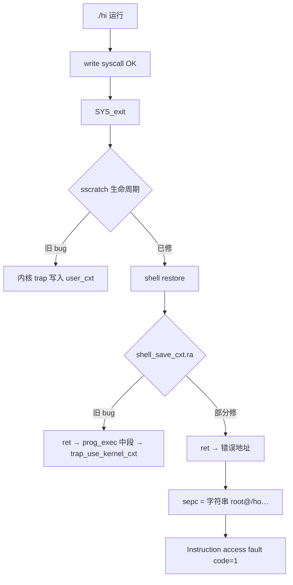
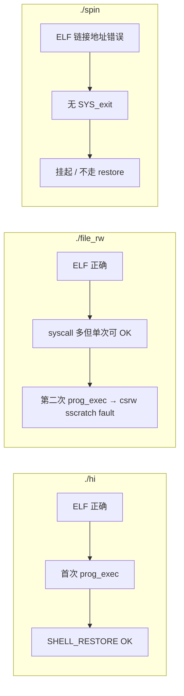

## 本次修改过程与进度记录

### 一、问题背景

| 现象 | 说明 |
|------|------|
| `./hi` / `./file_rw` | 能打印输出，但无法回到 `root@...$` |
| `./spin` | 无输出也会坏 |
| `sh script.sh` | 正常（纯内核路径） |
| Ctrl+Z / Ctrl+C 后 | 宿主机 TTY 异常，需 `stty sane` |

**结论**：问题在 **用户程序协程式执行**（`prog_exec` → `switch_to` → `SYS_exit` → 恢复 shell），不在 UART/ramfs/OpenSBI。

---

### 二、根因链条（按发现顺序）



---

### 三、已完成的代码修改

#### 1. `interrupt/entry.S` — trap / sscratch

- 用户 trap 保存后：`sscratch` 立即设回 `kernel_trap_cxt`（避免 C 里 nested trap 写坏 `user_cxt`）
- 用栈保存 restore frame `t5`，返回时用 `mv t6, t5`，不再依赖 `csrr sscratch`
- shell restore 路径：`la t6, shell_save_cxt`；`sret` 前再次 `csrw sscratch, kernel_trap_cxt`
- 用户 trap 在 kernel stack `0x80210000` 上跑 `trap_handler`

#### 2. `interrupt/trap.c`

- `SYS_exit` 路径去掉 `trap_use_kernel_cxt()`（trap 内 C 写 `sscratch` 曾 fault）
- `trap_handler` 入口恢复 `kernel gp`
- panic 打印 `scause / stval / sepc / sstatus / sscratch`

#### 3. `interrupt/trap_diag.c` + `include/trap_diag.h`

- syscall 返回打印：`RETURN sepc=… restore_frame=… sscratch=…`（UART，不用 printf）
- `SHELL_RESTORE branch #N` 计数
- `TRAP_DIAG_VERBOSE=0` 默认，减少 timer 刷屏

#### 4. `prog/loader.c` — 核心迭代

| 版本 | 改动 |
|------|------|
| v1 | `context_save_shell` + `shell_save_cxt.ra = caller_ra`（**仍错**：`context_save_shell` 后 `ra` 已变） |
| v2 | `sd ra,-72` 在 `context_save_shell` 前（**仍错**：`ra` 已被 `fs_read_file` 等改掉） |
| v3 | 函数入口 `asm("mv console_ra, ra")` |
| **当前** | `shell_cxt_clear` + `shell_cxt_capture`：显式 `ra/gp`；从 `prog_exec` 栈帧 **重建 shell 的 `sp/s0`**（`PROG_EXEC_FRAME=112`） |

#### 5. 其他

- `include/riscv.h`：`r_sscratch()`、`r_stval()`
- `Makefile`：链接 `trap_diag.c`
- 禁用 timer/soft IRQ 里的 preemptive `schedule()`

---

### 四、测试进度时间线

| 阶段 | 结果 |
|------|------|
| 初始 | `./hi` 打印后 panic @ `switch_to` / `w_sscratch` |
| sscratch 生命周期修复 | write syscall 成功；`RETURN sepc=0x8038004e` ✓ |
| `ra` 保存 bug #1 | shell restore 后 `ret` → `prog_exec` 中段 → `w_sscratch` panic |
| `ra` 保存 bug #2 | 不再 `w_sscratch`，但 `exec: segment out of range`（二次 `prog_exec`） |
| `console_ra` 入口捕获 + `shell_cxt_capture` | **最新日志**（见下） |

**最新一次 `./hi`（terminal 3）：**

```text
hi from ./hi
RETURN sepc=0x8038004e restore_frame=user_cxt sscratch=0x8020f5b0   ✓ write 返回
SHELL_RESTORE branch #0x1
RETURN sepc=0x80203fe6 restore_frame=shell_save_cxt sscratch=0x8020f5b0   ✓ trap 返回
Sync exception code = 1 at 0x6f682f40746f6f72   ✗ prog_exec_done 之后
```

---

### 五、对更新版 `problemrecord.txt` 的回答

#### 1. 还是 `sscratch` 问题吗？

**基本不是。** `sscratch=0x8020f5b0`（`kernel_trap_cxt`）在两次 RETURN 时都正确；trap 返回 `sepc=0x80203fe6`（`prog_exec_done`）也正常。

#### 2. `sepc=0x6f682f40746f6f72` 是什么？

**不是代码地址**，按字节近似 ASCII：

```text
72 6f 6f 74 40 2f 68 6f  →  "root@/ho"
```

与 shell 的 `prompt` 缓冲区（`root@/home/root$`）一致 → **CPU 把字符串内存当 PC 取指** → RISC-V **code=1 Instruction access fault**。

#### 3. trap 返回错了吗？

**没有。** `csrw sepc, prog_exec_done` + `reg_restore shell_save_cxt` + `sret` 已完成；故障在 **`prog_exec_done` 的 `ret` 之后**。

#### 4. `RETURN sepc=0x80203fe6` 不是 `0x80206688` 正常吗？

**正常。** 设计是：

```text
sret → prog_exec_done (sepc)
     → mv gp, kernel_gp
     → ret  (用 shell_save_cxt.ra 回 console)
```

`0x80206688` 是 console 里 `jal prog_exec` 的下一条，应由 **`ra`** 到达，不是 `sepc`。

#### 5. 第一嫌疑：`shell_save_cxt.ra` / 上下文不完整

**与记录一致，仍是当前主因。**

- `context_save_shell` 只写 callee-saved + `ra/sp/gp/tp/pc`
- `reg_restore` 恢复 **全部 32 槽**（含 `a0–a7`, `t0–t6`）
- 未保存的槽在 `shell_cxt_clear` 后为 0；若 `ra/sp/s0` 任一不对，`ret` 会跳进 rodata/栈上的字符串

已做 `shell_cxt_capture` 重建 `sp/s0`，但 **`ra` 是否在 restore 前被踩、或 `s0` 偏移 96 是否与当前 `prog_exec` 帧布局一致** 仍需 dump 验证。

#### 6. 第二嫌疑：`shell_save_cxt` 被覆盖

`user_cxt` / `shell_save_cxt` 在 kernel BSS（~`0x80212xxx`），不在用户 ELF 区；但若 **`ra` 指向 prompt 字符串**，更像是 **保存值错**，不一定是 struct 被踩。

---

### 六、当前状态总结

> **2026-05-31 更新**：详见 **第九～十一节**。下表为修复前快照，仅作历史参考。

| 子系统 | 状态 |
|--------|------|
| UART / console 读行 | 正常 |
| ELF 加载 + user syscall | 正常 |
| write syscall 返回 | **已通** |
| `SYS_exit` + shell restore trap | **已通** |
| `prog_exec_done` → shell 提示符 | **首次 prog_exec 已通**（见 §9.3） |
| `./file_rw` 完整流程 | **单独运行已通**；连续第二次 `prog_exec` 仍失败（见 §10.2） |

---

### 七、建议的下一步（与 problemrecord 一致）

1. **dump `shell_save_cxt`**：在 `shell_cxt_capture` 后、SHELL_RESTORE 的 `reg_restore` 前各打一次 `ra/sp/s0/gp`（UART 十六进制，勿用 printf）
2. **确认 `console_ra`**：应为 `shell_loop` 里 `jal prog_exec` 的下一条（当前约 `0x80206688`）
3. **验证 `PROG_EXEC_FRAME=112`** 与 `prog_exec` 实际栈帧一致（`-112` prologue + `s0` 在 `sp+96`）
4. 通过后回归：`./file_rw`、`./spin`、去掉或保留 trap-diag

---

### 八、涉及文件清单

```
code/myos/interrupt/entry.S
code/myos/interrupt/trap.c
code/myos/interrupt/trap_diag.c
code/myos/include/trap_diag.h
code/myos/include/riscv.h
code/myos/prog/loader.c
code/myos/Makefile

```

---

### 九、2026-05-31：`shell_cxt_capture` 修复（本次提交）

#### 9.1 问题定位（dump 验证后修正）

| 原假设 | dump / 实测结论 |
|--------|----------------|
| `shell_save_cxt.ra` 被踩成 prompt 字符串 | **否**：save 与 restore 前 `ra=0x8020675e` 一致，均为合法内核地址 |
| trap / `sepc` 返回错误 | **否**：`RETURN sepc=0x802040a6` = `prog_exec_done` |
| 根因 | **`sp`/`s0` 保存的是 `prog_exec` 栈帧，不是 `shell_loop` 的**；restore 后 shell 用错误栈继续跑 |

`0x6f682f40746f6f72`（`"root@/ho"`）是 **错误 `sp`/`s0` 下栈访问错位**，把 prompt 缓冲区内容当成了 `ret` 目标，而非 BSS 里 `ra` 字段被改写。

#### 9.2 代码改动（`prog/loader.c`）

新增逻辑：

1. **`shell_cxt_clear()`** — restore 前清零整个 `shell_save_cxt`（32 槽），避免 `reg_restore` 恢复未写入的 caller-saved 垃圾。
2. **`shell_cxt_capture()`** — 在 `prog_exec()` **入口**、任何 `fs_read_file` 等调用之前立即调用：
   - `console_ra`：`asm("mv %0, ra")` 捕获返回 shell 的地址；
   - `shell_save_cxt.gp = kernel_gp_value`（避免 `gp=0`）；
   - 从 `prog_exec` prologue 栈帧 **反推 shell 真实栈**：
     - `shell_sp = cur_sp + PROG_EXEC_FRAME`（112）
     - `shell_s0 = *(cur_sp + 96)`（prologue 里保存的原 shell `s0`）
3. 删除原先在 `switch_to` 前才做的 `context_save_shell()`（太晚，`sp`/`s0`/`s1–s11` 已变）。

#### 9.3 修复后实测

| 用例 | 结果 |
|------|------|
| `./hi`（首次 `prog_exec`） | **通过**：打印 `hi from ./hi`，回到 `root@/home/root$` |
| `./file_rw`（**首次**，单独跑） | **通过**：open/read/write 多次 syscall，输出文件内容，回到 prompt |
| `./sh/test-console-pipe.sh` | **通过**（login / ls / pwd / vi / cat / poweroff） |
| `./hi` → `./file_rw`（连续两次） | **失败**：第二次 `prog_exec` 在 `trap_use_kernel_cxt()` → `csrw sscratch` 处 **code=2 Illegal instruction** |
| `./spin`（单独） | **挂起**：无输出、不回到 prompt（见 10.3） |

---

### 十、为什么「看起来只对 `./hi` 有用」？

**结论：不是修复逻辑只适配 hi，而是三类不同的问题叠在一起。**

#### 10.1 `./hi` — 恰好是最「简单」的首个用例

`hi` 的用户态路径最短：

```text
write × 1 → SYS_exit × 1 → SHELL_RESTORE → prog_exec_done → shell prompt
```

且 **hi 的 ELF 构建正确**（见 10.3）。  
在 **登录后第一次** 执行 `prog_exec` 时，shell 仍处于 **S-mode**（内核正常特权），`trap_use_kernel_cxt()` 里的 `csrw sscratch` 合法，因此 **整条协程恢复链能走通**——这是用户最容易先测到、也最容易误以为「只有 hi 好了」的原因。

#### 10.2 `./file_rw` — 单次可通，连续执行仍坏（内核残留 bug）

`file_rw` 会触发 **多次** syscall（open / read / write / exit），每次 trap 都正确回到 `user_cxt`；**单独运行**时已在实测中 **正常回到 prompt**。

但若 **先跑 `./hi` 再跑 `./file_rw`**（第二次 `prog_exec`），会在：

```text
trap_use_kernel_cxt() → w_sscratch() → csrw sscratch, a5   @ 0x802019fe
```

触发 **Illegal instruction (code=2)**。  
推断：第一次用户程序退出并经 `sret` 链回到 shell 后，**CPU 特权级 / `sstatus` 未恢复为 S-mode**；shell 打印 prompt 仍可能「碰巧」工作，但第二次 `prog_exec` 末尾再次 `csrw sscratch` 时在 **U-mode 写 CSR** → 非法指令。  
**这与 `shell_cxt_capture` 无关，是「多次 prog_exec」的待修项**（需在 shell restore 或 `prog_exec_done` 路径显式恢复 S-mode / `sstatus`）。

#### 10.3 `./spin` — 用户 ELF 本身错误（与 shell 恢复无关）

对 `home/root/spin` 做 `readelf` / `objdump` 可见其与 `hi` / `file_rw` **不是同一套链接结果**：

| 项目 | `./hi` / `./file_rw` | `./spin`（当前磁盘上的二进制） |
|------|----------------------|--------------------------------|
| LOAD 虚拟地址 | `0x80380000`（`user.ld`） | **`0x81000000`**（错误） |
| `_start` 栈顶 | `0x80390000` | **`0x8100xxxx`**（错误） |
| 退出方式 | `crt0.S`：`main` 返回后 **`ecall` SYS_exit** | **`main` 返回后 `_start` 直接 `ret`**，无 syscall |
| 能否触发 `SHELL_RESTORE` | 能 | **不能**（永不 `SYS_exit`） |

因此 `./spin` 表现为 **挂死**（CPU 在错误地址 `ret`，走不进 exit 恢复路径），**不是** `shell_cxt_capture` 没覆盖 spin，而是 **spin 未按 `usr/compile.sh` + `crt0.S` + `user.ld` 重新打包**。  
修复方式：在 `home/root` 下执行 `./usr/compile.sh c spin.c`，再 `make home` 重打 ramfs。

#### 10.4 三者对比小结



| 程序 | shell 栈修复是否生效 | 仍失败的原因 |
|------|---------------------|--------------|
| `./hi` | 是 | 无（作为 **首个** ELF 时） |
| `./file_rw` | 是（单独跑已验证） | **第二次** `prog_exec` 时特权级 / `sscratch` CSR 写入 |
| `./spin` | 未机会验证 | **ELF 未正确编译**，程序不 exit |

---

### 十一、后续完成（spin 重编 + SPP 修复）

#### 11.1 `./usr/compile.sh c spin.c` + `make home`

重编后 `spin` 与 `hi`/`file_rw` 一致：

- Entry / LOAD：`0x80380000`
- `_start`：`crt0.S` 栈顶 `0x80390000`，`main` 返回后 **`ecall` SYS_exit**

#### 11.2 `interrupt/entry.S` — `sstatus.SPP`

| 路径 | 操作 |
|------|------|
| **SHELL_RESTORE**（用户 `SYS_exit`） | `csrs sstatus, SPP` → `sret` 回到 **S-mode** 内核（`prog_exec_done` / shell） |
| **switch_to**（进用户） | `csrc sstatus, SPP` → `sret` 进入 **U-mode** 用户程序 |

根因：用户态 syscall trap 后 `SPP=0`，若直接 `sret` 回内核 `sepc`，会在 **U-mode** 执行内核代码；第二次 `prog_exec` 里 `csrw sscratch` 触发 **code=2**。

#### 11.3 回归实测（2026-05-31）

```text
./spin      → 静默退出，回到 root@/home/root$
./hi        → hi from ./hi，回到 prompt
./file_rw   → 读 hello.txt 正常，回到 prompt
poweroff    → Shutting down myos...
./sh/test-console-pipe.sh → OK
```

§11 原「仍待解决」三项中，**1、2 已关闭**；**3（poweroff 偶发 code=2）** 在 SPP 修复后未再复现。

---

### 十二、涉及文件（含本节）

```
code/myos/prog/loader.c          ← shell_cxt_clear / shell_cxt_capture（本节核心）
code/myos/interrupt/entry.S
code/myos/interrupt/trap.c
code/myos/interrupt/trap_diag.c
code/myos/include/trap_diag.h
code/myos/include/riscv.h
code/myos/Makefile
code/myos/home/root/spin         ← 需重新 compile + pack（链接地址错误）
```

