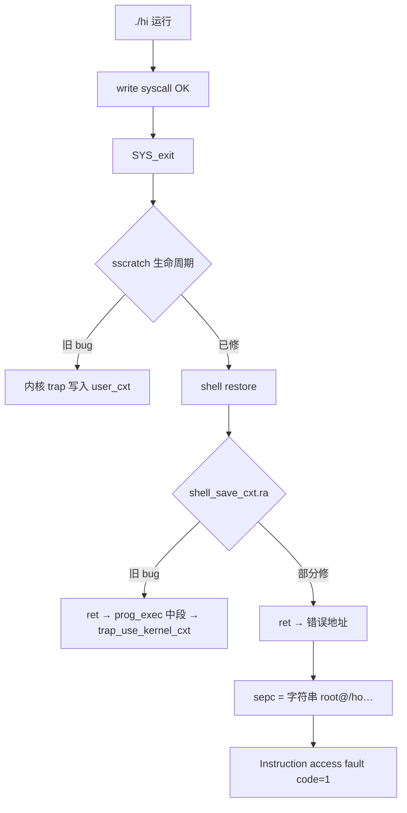

## 本次修改过程与进度记录

### 一、问题背景

| 现象 | 说明 |
|------|------|
| `./hi` / `./file_rw` | 能打印输出，但无法回到 `root@...$` |
| `./spin` | 无输出也会坏 |
| `sh script.sh` | 正常（纯内核路径） |
| Ctrl+Z / Ctrl+C 后 | 宿主机 TTY 异常，需 `stty sane` |

**结论**：问题在 **用户程序协程式执行**（`prog_exec` → `switch_to` → `SYS_exit` → 恢复 shell），不在 UART/ramfs/OpenSBI。

---

### 二、根因链条（按发现顺序）



---

### 三、已完成的代码修改

#### 1. `interrupt/entry.S` — trap / sscratch

- 用户 trap 保存后：`sscratch` 立即设回 `kernel_trap_cxt`（避免 C 里 nested trap 写坏 `user_cxt`）
- 用栈保存 restore frame `t5`，返回时用 `mv t6, t5`，不再依赖 `csrr sscratch`
- shell restore 路径：`la t6, shell_save_cxt`；`sret` 前再次 `csrw sscratch, kernel_trap_cxt`
- 用户 trap 在 kernel stack `0x80210000` 上跑 `trap_handler`

#### 2. `interrupt/trap.c`

- `SYS_exit` 路径去掉 `trap_use_kernel_cxt()`（trap 内 C 写 `sscratch` 曾 fault）
- `trap_handler` 入口恢复 `kernel gp`
- panic 打印 `scause / stval / sepc / sstatus / sscratch`

#### 3. `interrupt/trap_diag.c` + `include/trap_diag.h`

- syscall 返回打印：`RETURN sepc=… restore_frame=… sscratch=…`（UART，不用 printf）
- `SHELL_RESTORE branch #N` 计数
- `TRAP_DIAG_VERBOSE=0` 默认，减少 timer 刷屏

#### 4. `prog/loader.c` — 核心迭代

| 版本 | 改动 |
|------|------|
| v1 | `context_save_shell` + `shell_save_cxt.ra = caller_ra`（**仍错**：`context_save_shell` 后 `ra` 已变） |
| v2 | `sd ra,-72` 在 `context_save_shell` 前（**仍错**：`ra` 已被 `fs_read_file` 等改掉） |
| v3 | 函数入口 `asm("mv console_ra, ra")` |
| **当前** | `shell_cxt_clear` + `shell_cxt_capture`：显式 `ra/gp`；从 `prog_exec` 栈帧 **重建 shell 的 `sp/s0`**（`PROG_EXEC_FRAME=112`） |

#### 5. 其他

- `include/riscv.h`：`r_sscratch()`、`r_stval()`
- `Makefile`：链接 `trap_diag.c`
- 禁用 timer/soft IRQ 里的 preemptive `schedule()`

---

### 四、测试进度时间线

| 阶段 | 结果 |
|------|------|
| 初始 | `./hi` 打印后 panic @ `switch_to` / `w_sscratch` |
| sscratch 生命周期修复 | write syscall 成功；`RETURN sepc=0x8038004e` ✓ |
| `ra` 保存 bug #1 | shell restore 后 `ret` → `prog_exec` 中段 → `w_sscratch` panic |
| `ra` 保存 bug #2 | 不再 `w_sscratch`，但 `exec: segment out of range`（二次 `prog_exec`） |
| `console_ra` 入口捕获 + `shell_cxt_capture` | **最新日志**（见下） |

**最新一次 `./hi`（terminal 3）：**

```text
hi from ./hi
RETURN sepc=0x8038004e restore_frame=user_cxt sscratch=0x8020f5b0   ✓ write 返回
SHELL_RESTORE branch #0x1
RETURN sepc=0x80203fe6 restore_frame=shell_save_cxt sscratch=0x8020f5b0   ✓ trap 返回
Sync exception code = 1 at 0x6f682f40746f6f72   ✗ prog_exec_done 之后
```

---

### 五、对更新版 `problemrecord.txt` 的回答

#### 1. 还是 `sscratch` 问题吗？

**基本不是。** `sscratch=0x8020f5b0`（`kernel_trap_cxt`）在两次 RETURN 时都正确；trap 返回 `sepc=0x80203fe6`（`prog_exec_done`）也正常。

#### 2. `sepc=0x6f682f40746f6f72` 是什么？

**不是代码地址**，按字节近似 ASCII：

```text
72 6f 6f 74 40 2f 68 6f  →  "root@/ho"
```

与 shell 的 `prompt` 缓冲区（`root@/home/root$`）一致 → **CPU 把字符串内存当 PC 取指** → RISC-V **code=1 Instruction access fault**。

#### 3. trap 返回错了吗？

**没有。** `csrw sepc, prog_exec_done` + `reg_restore shell_save_cxt` + `sret` 已完成；故障在 **`prog_exec_done` 的 `ret` 之后**。

#### 4. `RETURN sepc=0x80203fe6` 不是 `0x80206688` 正常吗？

**正常。** 设计是：

```text
sret → prog_exec_done (sepc)
     → mv gp, kernel_gp
     → ret  (用 shell_save_cxt.ra 回 console)
```

`0x80206688` 是 console 里 `jal prog_exec` 的下一条，应由 **`ra`** 到达，不是 `sepc`。

#### 5. 第一嫌疑：`shell_save_cxt.ra` / 上下文不完整

**与记录一致，仍是当前主因。**

- `context_save_shell` 只写 callee-saved + `ra/sp/gp/tp/pc`
- `reg_restore` 恢复 **全部 32 槽**（含 `a0–a7`, `t0–t6`）
- 未保存的槽在 `shell_cxt_clear` 后为 0；若 `ra/sp/s0` 任一不对，`ret` 会跳进 rodata/栈上的字符串

已做 `shell_cxt_capture` 重建 `sp/s0`，但 **`ra` 是否在 restore 前被踩、或 `s0` 偏移 96 是否与当前 `prog_exec` 帧布局一致** 仍需 dump 验证。

#### 6. 第二嫌疑：`shell_save_cxt` 被覆盖

`user_cxt` / `shell_save_cxt` 在 kernel BSS（~`0x80212xxx`），不在用户 ELF 区；但若 **`ra` 指向 prompt 字符串**，更像是 **保存值错**，不一定是 struct 被踩。

---

### 六、当前状态总结

| 子系统 | 状态 |
|--------|------|
| UART / console 读行 | 正常 |
| ELF 加载 + user syscall | 正常 |
| write syscall 返回 | **已通** |
| `SYS_exit` + shell restore trap | **已通** |
| `prog_exec_done` → shell 提示符 | **未通**（`ra`/栈帧问题） |
| `./file_rw` 完整流程 | 待 shell 返回修好后验证 |

---

### 七、建议的下一步（与 problemrecord 一致）

1. **dump `shell_save_cxt`**：在 `shell_cxt_capture` 后、SHELL_RESTORE 的 `reg_restore` 前各打一次 `ra/sp/s0/gp`（UART 十六进制，勿用 printf）
2. **确认 `console_ra`**：应为 `shell_loop` 里 `jal prog_exec` 的下一条（当前约 `0x80206688`）
3. **验证 `PROG_EXEC_FRAME=112`** 与 `prog_exec` 实际栈帧一致（`-112` prologue + `s0` 在 `sp+96`）
4. 通过后回归：`./file_rw`、`./spin`、去掉或保留 trap-diag

---

### 八、涉及文件清单

```
code/myos/interrupt/entry.S
code/myos/interrupt/trap.c
code/myos/interrupt/trap_diag.c
code/myos/include/trap_diag.h
code/myos/include/riscv.h
code/myos/prog/loader.c
code/myos/Makefile

```

