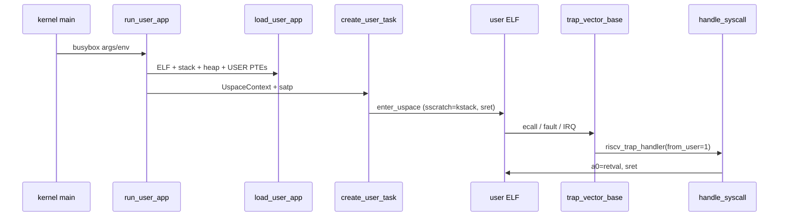

# T202510003995291-2331 — U-Mode Summary

Reference tree: **Undefined-OS** (competition monolithic kernel) built on **ArceOS** with the `uspace` feature.  
Competition builds target **riscv64** and **loongarch64** (`Makefile` `test_build`).

User programs are **musl-linked ELF binaries** (e.g. `/musl/busybox sh -c …`) loaded from the disk image, not kernel-linked “user tasks.”

---

## 1. Project shape (relevant to myos)

| Aspect | Reference (T202510…) | myos |
|--------|----------------------|------|
| Language | Rust (axhal + starry-core + api) | C |
| User isolation | **Per-process Sv39 page tables** (`satp` in `TaskContext`) | **Flat kernel map**; user VA range `[0x80380000, 0x80400000)` |
| Enter U-mode | `UspaceContext::enter_uspace()` → `sret` | `switch_to(uc)` + clear `SPP` → `sret` |
| Trap from U | `sscratch` swap (RISC-V) | `sscratch` + EPC range check → per-process frame |
| Syscall | `ecall` → `UserEnvCall` → `handle_syscall` (a7 = nr) | `ecall` → trap handler → `syscall_dispatch` |
| User exit | `exit`/`exit_group` syscalls (normal return to U) | `proc_user_exit_pending` + **user-exit trampoline** |
| ELF load | Map segments with `MappingFlags::USER`, auxv stack | Copy segments into fixed VA, no PTE `U` bit |
| Clone/fork | Full Linux-style `clone` + COW addr space | Copy trap frame + stub `user_mem_copy` |

**Bottom line for myos:** the reference is a **full Linux-compat userland OS** with paging and syscalls; myos has a **minimal in-kernel user ABI** on a shared address map. Use the reference for **trap/U-mode mechanics and syscall layering**, not as a drop-in for myos’s flat-memory model.

---

## 2. Build / feature wiring

Competition kernel enables user space through Cargo features:

```34:34:T202510003995291-2331/Cargo.toml
axhal = { git = "https://github.com/oscomp/arceos.git", features = ["uspace", "rtc"] }
```

`axhal` feature chain: `uspace` → `paging` → page-table support in `TaskContext` and trap handlers.

Boot-time RISC-V setup (per-CPU, before `rust_main`):

```20:26:T202510003995291-2331/arceos/modules/axhal/src/platform/riscv64_qemu_virt/mod.rs
unsafe extern "C" fn rust_entry(cpu_id: usize, dtb: usize) {
    crate::mem::clear_bss();
    crate::cpu::init_primary(cpu_id);
    #[cfg(feature = "uspace")]
    riscv::register::sstatus::set_sum();
    self::time::init_early();
    rust_main(cpu_id, dtb);
}
```

**SUM** (Supervisor User Memory access) lets the kernel read/write user pages without temporarily flipping privilege — required for copy-in/copy-out in syscalls.

---

## 3. User virtual memory layout

From `configs/riscv64.toml` / `configs/loongarch64.toml` (same layout):

| Region | Address / size |
|--------|----------------|
| User space base | `0x1000` |
| User space size | `0x3f_ffff_f000` |
| Interpreter base | `0x400_0000` |
| Stack top | `0x4_0000_0000` (1 MiB stack below) |
| Heap base | `0x4000_0000` (64 KiB) |
| Signal trampoline | `0x4001_0000` |
| Kernel stack / task | `0x40000` bytes |

### 3.1 Address space creation (`core/src/mm.rs`)

1. `new_user_aspace_empty()` — empty Sv39 page table for user VA range.
2. `copy_from_kernel()` — on **riscv64**, copy kernel PTE mappings into the user page table (shared upper/kernel portion in one `satp` root). **Not** done on aarch64/loongarch64 (separate user page-table base registers).
3. `map_trampoline()` — map signal-return stub at `SIGNAL_TRAMPOLINE` with `READ | EXECUTE | USER`.
4. `load_user_app()` — ELF PT_LOAD segments, stack (args/env/auxv), heap; all user mappings tagged `MappingFlags::USER`.

Page faults in user mode go to `src/mm.rs` → `addr_space.handle_page_fault()`; unhandled faults send **SIGSEGV**.

### 3.2 Per-task page table

Each user task stores its `satp` root in `TaskContext`. On context switch:

```379:384:T202510003995291-2331/arceos/modules/axhal/src/arch/riscv/context.rs
        #[cfg(feature = "uspace")]
        unsafe {
            if self.satp != next_ctx.satp {
                super::write_page_table_root(next_ctx.satp);
            }
        }
```

---

## 4. Entering U-mode (RISC-V)

### 4.1 `UspaceContext` — initial user CPU state

`UspaceContext` wraps a full `TrapFrame`. For a new process:

```198:220:T202510003995291-2331/arceos/modules/axhal/src/arch/riscv/context.rs
    pub fn new(entry: usize, ustack_top: VirtAddr, arg0: usize) -> Self {
        const BIT_SPIE: usize = 5;
        const BIT_SUM: usize = 18;

        let mut sstatus: usize = 0;
        sstatus |= 1 << BIT_SPIE;
        sstatus |= 1 << BIT_SUM;
        // ...
        Self(TrapFrame {
            regs: GeneralRegisters {
                a0: arg0,
                sp: ustack_top.as_usize(),
                ..Default::default()
            },
            sepc: entry,
            sstatus,
        })
    }
```

- **`sepc`** = ELF entry.
- **`sp`** = user stack pointer (16-byte aligned, with argc/argv/env/auxv below SP).
- **`sstatus`**: `SPIE=1` (interrupts restorable on `sret`), `SUM=1`; **`SPP=0`** (implicit — enter U-mode on `sret`).

Competition entry passes magic `arg0 = 2333` (test harness convention).

### 4.2 `enter_uspace` — one-way drop into userland

Called from the user task closure in `create_user_task`:

```137:168:T202510003995291-2331/core/src/task.rs
pub fn create_user_task(name: String, uctx: UspaceContext) -> TaskInner {
    TaskInner::new(
        move || {
            let kstack_top = current().kernel_stack_top().unwrap();
            // ... set_child_tid ...
            unsafe { uctx.enter_uspace(kstack_top) }
        },
        name,
        axconfig::plat::KERNEL_STACK_SIZE,
    )
}
```

`enter_uspace` (RISC-V):

1. `sscratch = kstack_top` (kernel stack top; used when U-mode traps).
2. Restore user `gp`/`tp` from frame; load `sstatus`, GPRs, user `sp`.
3. **`sret`** — does not return.

Unlike myos, there is **no** separate `switch_to` scheduler dance at U-mode entry: the ArceOS task runs on its kernel stack until `enter_uspace`, then lives entirely in the trap-return loop.

### 4.3 App launch pipeline (`src/entry.rs`)

```
run_user_app(args, envs)
  → new_user_aspace_empty + copy_from_kernel + map_trampoline
  → load_user_app (ELF + stack + heap)
  → UspaceContext::new(entry, ustack_top, 2333)
  → create_user_task + set_page_table_root(uspace.page_table_root())
  → Process / Thread / FD / FS namespace setup
  → axtask::spawn_task + join
```

`main()` runs busybox via `include_str!(env!("AX_TESTCASES_FILE"))`.

---

## 5. Traps from U-mode (RISC-V)

### 5.1 Assembly entry (`trap.S`)

Same pattern as documented in `0602_ref_trap_uart_summary.md`:

- `sscratch == 0` → trap from S-mode (kernel).
- `sscratch != 0` → trap from U-mode: swap `sp` ↔ `sscratch`, save frame on **kernel stack**.

User path (`SAVE_REGS 1`):

- Saves user `sp` in frame; swaps to kernel `gp`/`tp`.
- On restore: writes `sscratch = kstack_top` again for next U trap.

### 5.2 C handler (`arch/riscv/trap.rs`)

| Exception | Action |
|-----------|--------|
| `UserEnvCall` | `sepc += 4`; `a0 = handle_syscall(tf, a7)` |
| Load/Store/Inst page fault | `handle_page_fault(..., from_user)` |
| Breakpoint | `sepc += 2` |
| Interrupt | `IRQ` slice dispatch |

IRQ deferral: unmask during exception handling if `SPIE` was set; mask before return.

### 5.3 Post-trap (signals)

```70:77:T202510003995291-2331/api/src/imp/task/signal.rs
#[register_trap_handler(POST_TRAP)]
fn post_trap_callback(tf: &mut TrapFrame, from_user: bool) {
    if !from_user {
        return;
    }
    check_signals(tf, None);
}
```

Pending signals are checked **after every user trap**, before `sret` back to U.

---

## 6. Syscall path

### 6.1 Registration

Single handler registered via linkme:

```28:38:T202510003995291-2331/src/syscall.rs
#[register_trap_handler(SYSCALL)]
fn handle_syscall(tf: &mut TrapFrame, syscall_num: usize) -> isize {
    let sysno = Sysno::new(syscall_num as _);
    // ...
    set_trap_frame(tf);
    time_stat_from_user_to_kernel();
    let result: LinuxResult<isize> = match sysno {
        Sysno::read => sys_read(...),
        Sysno::write => sys_write(...),
        // ... ~100+ syscalls ...
```

RISC-V convention: **syscall number in `a7`**, args in `a0`–`a5`, return in `a0`.

### 6.2 User pointer safety (`api/src/ptr.rs`)

Syscall implementations use `UserPtr` / `UserConstPtr`:

- Validate VA against process `AddrSpace` (`check_region_access`, `populate_area`).
- Wrap kernel accesses in `access_user_memory()` so **kernel page faults while touching user buffers** are handled as user faults, not panics.

```209:226:T202510003995291-2331/core/src/mm.rs
pub fn access_user_memory<R>(f: impl FnOnce() -> R) -> R {
    ACCESSING_USER_MEM.with_current(|v| {
        *v = true;
        let result = f();
        *v = false;
        result
    })
}
```

### 6.3 Console from user (`write` syscall path)

On riscv64, SBI console write copies user buffers to kernel if pointer is in user VA (`console.rs` `uspace` branch) before calling OpenSBI.

---

## 7. Clone / threads / exec

### 7.1 `clone` (`api/src/imp/task/clone.rs`)

- Duplicates current trap frame from kernel stack: `read_trapframe_from_kstack` → `UspaceContext::from`.
- Adjusts `sp`, `retval=0`, optional TLS.
- **Same process (CLONE_THREAD)**: share `addr_space`, new thread in existing process.
- **Fork-like**: clone or share address space per `CLONE_VM` / `CLONE_VFORK`; `copy_from_kernel` on new tables when needed.
- Spawns new `create_user_task` with appropriate `satp`.

### 7.2 `execve`

Reloads ELF into existing address space (via `load_user_app` in exec path), replaces `UspaceContext`, continues in same task slot.

---

## 8. LoongArch64 differences (also in competition build)

| Mechanism | RISC-V | LoongArch64 |
|-----------|--------|-------------|
| U-mode detect | `sscratch` swap | `PRMD.PPLV != 0` at exception entry |
| Return to U | `sret` | `ertn` |
| Syscall trap | `UserEnvCall` (ecall) | `Exception::Syscall` |
| Initial mode | `sstatus.SPP=0`, SPIE, SUM | `prmd = PLV3 \| PIE` |
| Kernel stack on U trap | `sscratch` | `KSAVE_KSP` CSR |
| User page table | Shared kernel copy in `satp` | **Separate PGDL** — no `copy_from_kernel` |

LoongArch `enter_uspace` saves kernel `tp`/`r21` to CSRs, restores user regs, `ertn`.

---

## 9. Comparison with myos (current)

### myos U-mode entry (abbreviated)

```173:178:code/myos/proc/proc_user.c
	uctx_clear(uc);
	uc->pc = entry;
	uc->sp = USER_STACK_TOP;
```

```229:244:code/myos/proc/proc_user.c
int proc_user_run(int pid)
{
	// save kernel ra/sp
	user_trap_save_cxt = uc;
	trap_use_kernel_cxt();
	switch_to(uc);   // cooperative switch; reg_restore clears SPP → sret to U
```

- **No `satp` switch** — user and kernel share one map.
- **No `SUM`** setup documented; user pages are just normal kernel-mapped RAM.
- **User-exit trampoline** required because `exit` syscall leaves `SPP=0`; myos forces `SPP=1` before `sret` to land in kernel (`entry.S` + `proc_user_exit_pending`).

### myos trap frame selection

Uses **EPC range** `[user_code_start, user_code_end)` instead of only `sscratch`:

```141:152:code/myos/interrupt/entry.S
	csrr	t4, CSR_EPC
	la	t0, user_code_start
	ld	t0, 0(t0)
	bltu	t4, t0, 1f
	// ...
	la	t0, user_trap_save_cxt
	ld	t6, 0(t0)
```

Per-process frame via `user_trap_save_cxt`; reference uses **one frame per trap on current task’s kernel stack** (no global pointer).

---

## 10. What is / is not suitable to copy

| Topic | Suitable from reference? | Notes |
|-------|-------------------------|-------|
| `sscratch` = kernel SP while in U | **Yes** | myos already uses `sscratch`; align semantics with reference |
| `sstatus.SUM` at boot | **Yes (if keeping flat map)** | Lets kernel touch user buffers safely on fault paths |
| `UspaceContext` / `SPIE`+`SPP=0` on first `sret` | **Partially** | myos `switch_to` must clear `SPP`; ensure `SPIE`/`SIE` policy matches |
| Per-process `satp` | **No (for now)** | Major myos rework; reference assumes Sv39 throughout |
| `access_user_memory` + page fault → SIGSEGV | **Concept only** | myos has no user page tables or signals |
| Linux syscall table + `UserPtr` | **Partially** | Good model for extending myos syscalls; overkill for shell-only |
| `clone` / COW / exec | **No** | Full process model; myos fork is stub |
| Signal trampoline mapping | **No** | Requires axsignal + mapped stub page |
| Post-trap signal delivery | **No** | myos has no signal layer |
| LoongArch PGDL split | **N/A for myos riscv64** | Relevant only if porting |

---

## 11. End-to-end U-mode flow (RISC-V)



---

## 12. One-paragraph verdict

**T202510003995291-2331 implements U-mode as a full ArceOS `uspace` stack:** separate user page tables (`satp`), `UspaceContext` + `enter_uspace`/`sret`, `sscratch`-based kernel stacks on trap, `ecall` → large Linux syscall surface with validated user pointers, and post-trap signal delivery. It is the **Undefined-OS competition kernel**, not the minimal teaching path in `code/basic`. For **myos**, the highest-value reference pieces are **`sscratch` trap discipline**, **`sstatus.SUM`**, and **syscall/trap-frame handling**; the **page-table-per-process**, **signal trampoline**, and **SBI user-buffer copy** paths are orthogonal to myos’s current flat user region and MMIO console model.
